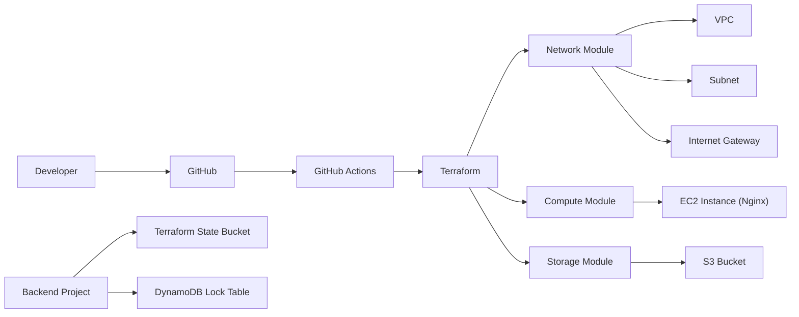

# Terraform AWS Infrastructure Assignment

## Overview

This project provisions a simple AWS infrastructure using reusable Terraform modules and follows Infrastructure as Code (IaC) best practices.

The infrastructure includes:

* Amazon VPC
* Public Subnet
* Internet Gateway
* Route Table
* Amazon EC2 Instance
* Amazon S3 Bucket
* Remote Backend (S3 + DynamoDB)
* GitHub Actions for Terraform validation

The project is organized into reusable modules to improve maintainability and scalability.

---

# Architecture



---

# Features

* Modular Terraform code
* Reusable infrastructure modules
* Dynamic Amazon Linux 2023 AMI lookup
* EC2 provisioning with Nginx installation using `user_data`
* S3 bucket with:

  * Versioning
  * Server-side encryption
  * Public access blocking
* Terraform remote backend example
* DynamoDB state locking
* GitHub Actions for Terraform validation

---

# Project Structure

```text
.
├── .github/
│   └── workflows/
│       └── terraform.yml
│
├── backend/
│   ├── main.tf
│   ├── outputs.tf
│   ├── providers.tf
│   ├── terraform.tfvars.example
│   ├── variables.tf
│   ├── versions.tf
│   └── README.md
│
├── modules/
│   ├── compute/
│   ├── network/
│   └── storage/
│
├── backend.tf
├── main.tf
├── outputs.tf
├── providers.tf
├── variables.tf
├── versions.tf
├── terraform.tfvars.example
└── README.md
```


---

# Prerequisites

* Terraform >= 1.6
* AWS Account
* AWS CLI configured
* Git
* GitHub account

---

# Deployment

Clone the repository.

```bash
git clone <repository-url>

cd terraform-multicloud-assignment
```

Initialize Terraform.

```bash
terraform init
```

Review the execution plan.

```bash
terraform plan
```

Deploy the infrastructure.

```bash
terraform apply
```

---

# Remote State Management

By default, Terraform stores its state locally in a file named `terraform.tfstate`. While this works for individual development, it is not suitable for team environments because the state file exists only on a single machine and cannot be shared safely.

To support collaborative infrastructure management, this project includes a separate Terraform configuration in the `backend/` directory that provisions the resources required for a remote backend.

The backend infrastructure consists of:

* **Amazon S3 Bucket** – Stores the Terraform state file (`terraform.tfstate`) in a centralized location, allowing multiple users or CI/CD pipelines to work with the same infrastructure state.
* **Amazon DynamoDB Table** – Provides state locking to prevent concurrent Terraform operations. Before Terraform modifies the infrastructure, it acquires a lock in the DynamoDB table. If another user or pipeline attempts to run `terraform apply` while the lock is held, Terraform blocks the operation until the lock is released, preventing state corruption.

The main project contains a commented `backend.tf` file that demonstrates how these backend resources can be configured.

## Backend Provisioning Workflow

1. Navigate to the `backend/` directory.
2. Run `terraform init`.
3. Run `terraform apply` to provision:

   * Amazon S3 bucket
   * Amazon DynamoDB table
4. Update the values in the root `backend.tf` file with the names of the created resources.
5. Run `terraform init -reconfigure` from the root project to migrate the local state to the remote backend.

Once configured, Terraform stores its state in Amazon S3 while using DynamoDB to ensure that only one Terraform operation can modify the state at a time.

### Why Remote State?

Using a remote backend provides several advantages:

* Centralized state management for teams.
* Protection against concurrent infrastructure changes through state locking.
* Improved collaboration across multiple developers and CI/CD pipelines.
* Better reliability by storing state outside the local machine.
* Support for versioning and recovery when S3 bucket versioning is enabled.


# GitHub Actions

The repository includes a GitHub Actions workflow that automatically performs the following checks on every push and pull request:

* Terraform formatting check (`terraform fmt`)
* Terraform initialization (`terraform init`)
* Terraform configuration validation (`terraform validate`)
* Terraform linting using **TFLint**

These automated checks help ensure consistent formatting, validate the Terraform configuration, and identify potential issues or best practice violations before infrastructure changes are applied.


---

# Outputs

After a successful deployment, Terraform displays useful outputs including:

* EC2 Public IP
* VPC ID
* S3 Bucket Name

---

# Cleanup

To remove all created resources:

```bash
terraform destroy
```

If a remote backend has been configured, destroy the application infrastructure before deleting the backend resources.


---

# Author

**Tharunraj Ravi**
